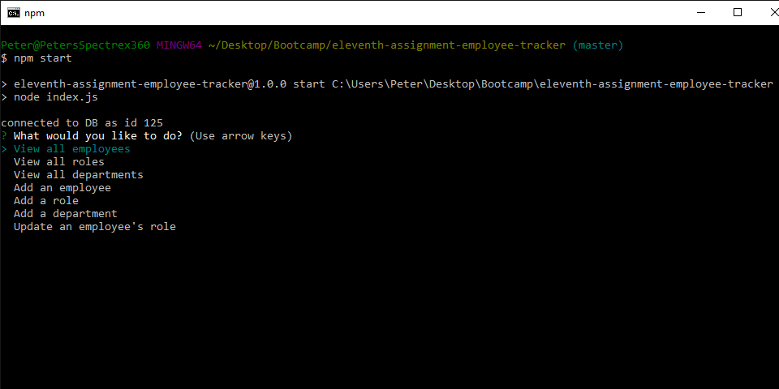
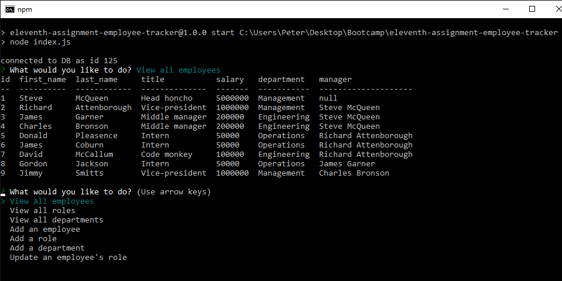
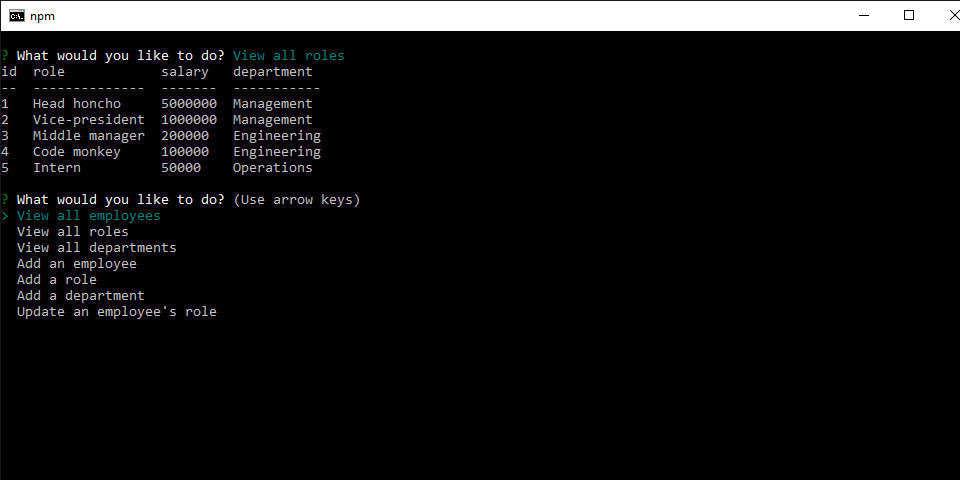
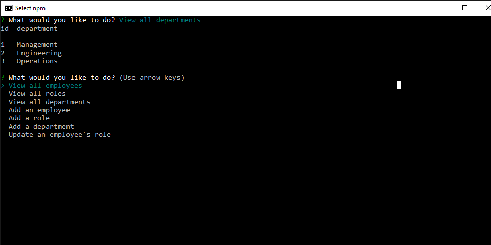
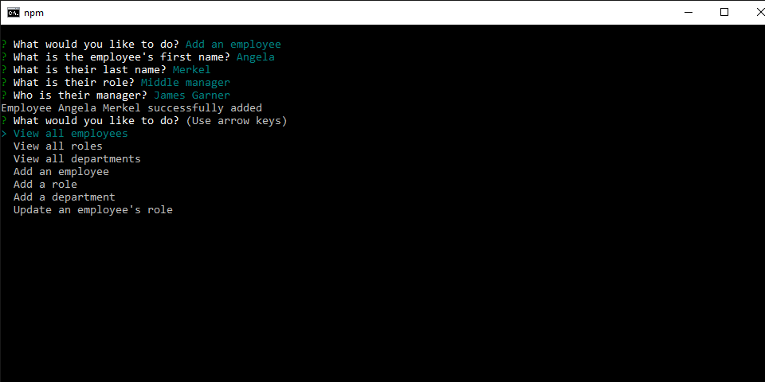
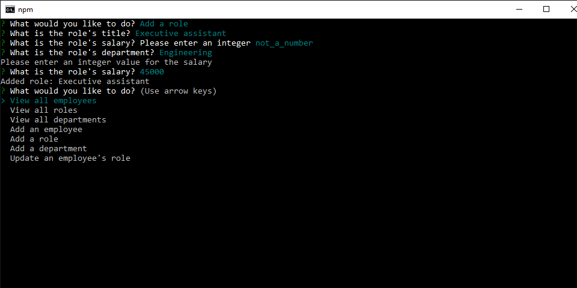
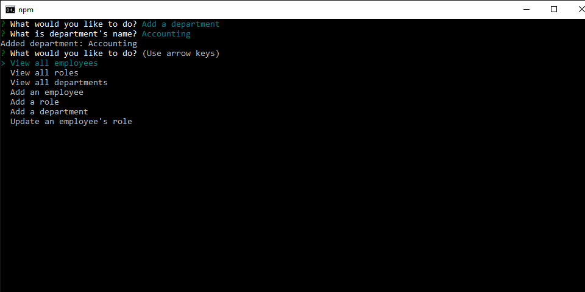
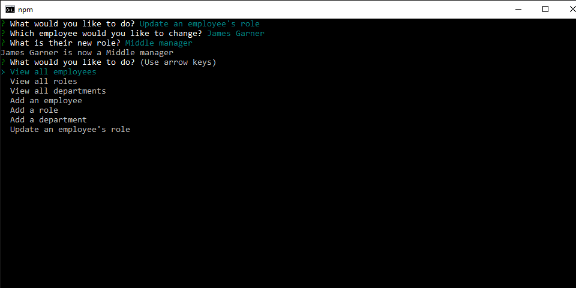
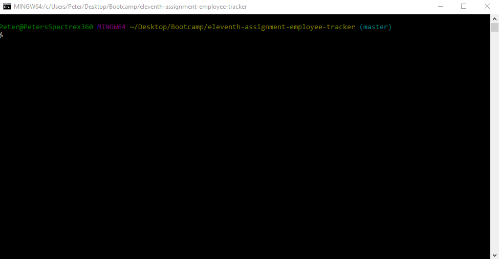

# Assignment 11: Employee Tracker

## A Node CLI tool which tracks and edits employees across an organization

Tool initiates with a list of actions: View/add employees, view/add roles, view/add departments, or update employee roles.

Viewing employees with salaries, departments, titles, and managers

Viewing roles

Viewing departments

Adding an employee: the user is prompted for a first name, last name, role, and manager.

Adding a role: the user is prompted for a title, department, and salary. The user is re-prompted if the salary is not a valid numerical input.

Adding a department

Changing an employee's role

## Full app demonstration

